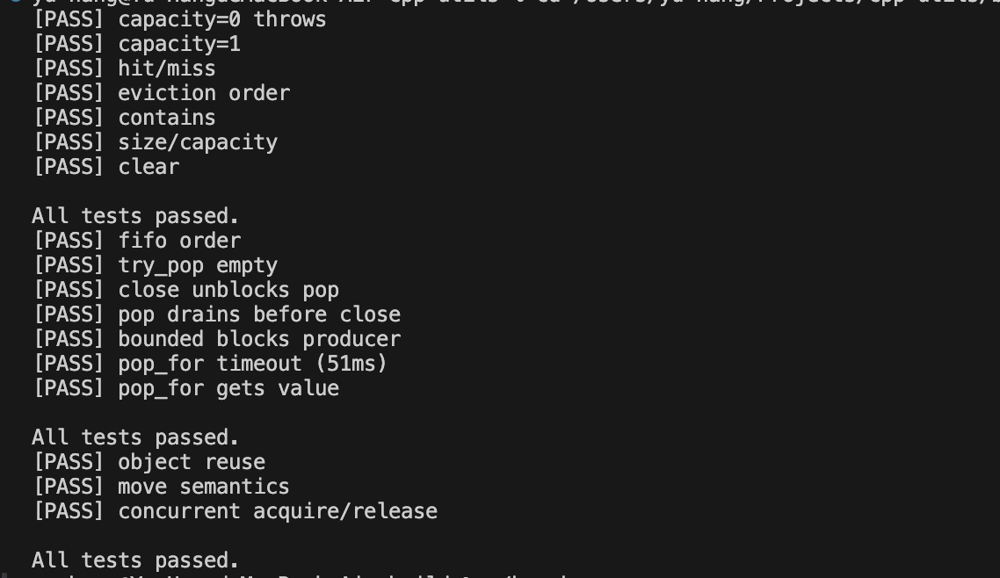
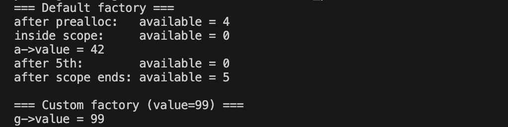
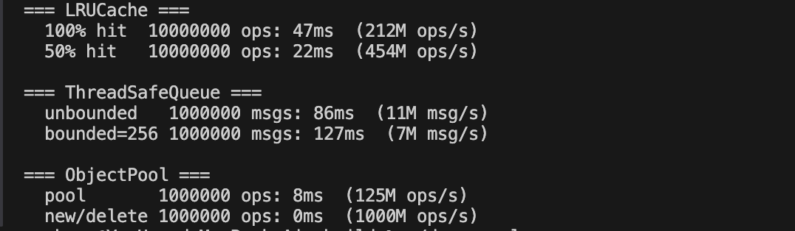

# cpp-utils
Header-only C++14 utility library. Demonstrates STL proficiency, templates, RAII, friend class, and thread-safe design.

## Changelog

### v1.1
- **LRUCache**: add `get_or_insert(key, factory)` — combines get + conditional put in one call; factory is only invoked on cache miss
- **ThreadSafeQueue**: add `push_for(value, timeout)` — bounded producer can now time out instead of blocking forever; completes the push/pop API symmetry
- **ObjectPool**: add optional `reset_fn` parameter — called on object return to clear stale state before reuse; defaults to `nullptr` for full backward compatibility
- **README**: benchmark numbers updated to actual M1 measurements

### v1.0
- Initial release: `LRUCache`, `ThreadSafeQueue`, `ObjectPool`, `Optional`

## Usage
```cpp
#include "utils/LRUCache.h"
#include "utils/ThreadSafeQueue.h"
#include "utils/ObjectPool.h"
```
No build step required — just add `include/` to your include path.

## Components

### LRUCache\<K, V\>
O(1) get/put using `std::list` + `std::unordered_map`. Evicts least-recently-used entry when capacity is exceeded.
```cpp
LRUCache<int, std::string> cache(3);
cache.put(1, "one");
auto v = cache.get(1);                          // Optional<string>
cache.get_or_insert(1, []{ return "one"; });    // V — factory only called on miss
cache.contains(1);                              // bool
cache.size();                                   // size_t
cache.clear();
```

### ThreadSafeQueue\<T\>
Blocking, thread-safe queue with optional bounded capacity.
```cpp
ThreadSafeQueue<int> q(/*capacity=*/256); // 0 = unbounded
q.push(42);
q.push_for(42, 50ms);                     // bounded producer with timeout → bool
auto v = q.pop();                         // blocks until item available
auto v = q.try_pop();                     // non-blocking
auto v = q.pop_for(50ms);                // timeout
q.close();                                // unblocks all waiting push/pop
```

### ObjectPool\<T\>
Pre-allocates objects and reuses them via RAII `PoolGuard`. Supports custom factory and reset injection. Thread-safe.
```cpp
// default factory
ObjectPool<MyObj> pool(4);
// custom factory (Dependency Injection)
ObjectPool<MyObj> pool(4, []{ return new MyObj(99); });
// with reset_fn — clears state on return
ObjectPool<MyObj> pool(4,
    []{ return new MyObj(); },
    [](MyObj* o){ o->reset(); });
{
    auto g = pool.acquire();     // returns PoolGuard (move-only)
    g->value = 42;
}                                // reset_fn called, then returned to pool
pool.available();                // size_t
```

## Build
```bash
mkdir build && cd build
cmake .. -DCMAKE_BUILD_TYPE=Release
make
```
Targets: `demo_lru`, `test_lru`, `demo_queue`, `test_queue`, `demo_pool`, `test_pool`, `bench`

## Tests


## Demo — ObjectPool RAII


## Benchmark
**Environment**: Apple M1 / macOS 15 / Apple Clang 21 / -O2 / C++14


### LRUCache — 10M ops
| scenario  | time  | throughput |
|-----------|-------|------------|
| 100% hit  | 32ms  | 312M ops/s |
| 50% hit   | 21ms  | 476M ops/s |

100% hit is *slower* than 50% hit because every hit calls `list::splice` to move the node to front. A miss returns early with no splice, so 50% hit does half the work.

### ThreadSafeQueue — 1M msgs, 4 producers + 4 consumers
| mode         | time  | throughput |
|--------------|-------|------------|
| unbounded    | 84ms  | 11M msg/s  |
| bounded=256  | 131ms | 7M msg/s   |

Bounded is slower because producers must also wait on `not_full_`, adding contention on a second condition variable.

### ObjectPool — 1M ops, single-threaded
| mode       | time | throughput   |
|------------|------|--------------|
| pool       | 8ms  | 125M ops/s   |
| new/delete | 0ms  | >1000M ops/s |

In low-contention single-threaded use, ObjectPool is *slower* than `new/delete` because mutex lock/unlock overhead exceeds the cost of the system allocator (which is heavily optimized on Apple Silicon). Pool's advantage appears under multi-threaded high-contention workloads where allocation costs spike.

## Design Notes
- **C++14 only** — no C++17 features; `std::optional` replaced by a minimal `Optional<T>` in `include/utils/Optional.h`
- **Header-only** — all template implementations live in `.h` files
- **STL only** — no third-party dependencies
- **Factory injection** — `ObjectPool` accepts a custom factory function (Dependency Injection pattern)

## Run Tests & Demos
```bash
# 全部測試
./build/test_lru
./build/test_queue
./build/test_pool
# Demo
./build/demo_lru
./build/demo_queue
./build/demo_pool
# Benchmark
./build/bench
```
